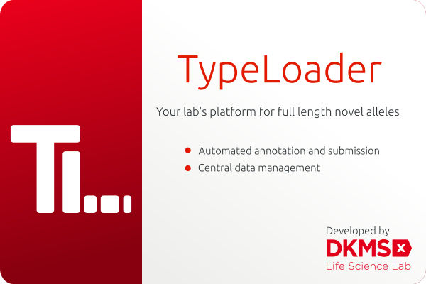

# Introduction

You have discovered novel HLA, KIR or MIC alleles, but you have not yet submitted them to the European Nucleotide Archive ([ENA](https://www.ebi.ac.uk/ena/submit)) and to [IPD-IMGT/HLA](https://www.ebi.ac.uk/ipd/imgt/hla/) or [IPD-KIR](https://www.ebi.ac.uk/ipd/kir/)? You have extended HLA, KIR or MIC alleles to full length that are currently only partially known? Maybe you have already submitted alleles, but the tedious process of manually annotating and submitting them each individually is wrecking your nerves and costing you hours you'd rather spend on doing something more productive?

**Welcome to TypeLoader!**

TypeLoader was developed at [DKMS Life Science Lab](https://dkms-lab.de/) to automate the annotation and submission of novel HLA, KIR and MIC alleles as far as possible. This reduces the hands-on time and error rate of creating the submission files by over 95%. Meanwhile, we have submitted [over 3000 HLA alleles](https://www.ncbi.nlm.nih.gov/pubmed/28547825) and a growing number of KIR and MIC alleles using this software. 

We are making TypeLoader available to others, to get all those full-length alleles submitted - for a more complete and a more consistent reference database for all of us in the HLA, KIR and MIC communities.

# Features
## Raw sequences
 * Accepts full-length sequences as plain fasta files or in the XML format generated by GenDx' NGSEngine [(=> Adding new alleles)](new_allele.md)
 * Automatically annotates all exon-intron boundaries by finding the closest offically known allele and using it as a reference. [(=> How TypeLoader works)](typeloader_core.md)
 * Supported loci: 
	 * HLA class I: HLA-A, -B, -C, -E, -F, -G, -H, -J, -K
	 * HLA class II: HLA-DRB1, -DQB1, -DPB1, -DQA1, -DPA1, -DMA, -DMB, -DOA, -DOB
	 * KIR: all human KIR genes
	 * MICA and MICB

## ENA submission
 * Generate ENA projects with a few clicks. [(=> Adding new projects)](new_project.md)
 * Automatically generate files for submission to ENA. [(=> Adding new alleles)](new_allele.md)
 * Automatically submit files to ENA. [(=> ENA submission)](submission_ena.md)

## IPD Submission
 * Automatically generate files for IPD submission (once a reply from ENA with an allele ID has been received) [(=> IPD submission)](submission_ipd.md)

## Data management and organization
 * Keep track of all your novel and extended full-length alleles:
  * Exhaustive and filterable [=> Overviews](overviews.md) over your projects and alleles
  * Clearly arranged [=> Detailed Views](detailed_views.md) to access and edit lots of metadata about your sequences
  * Clear and intuitive [=> Navigation area](navigation.md) 

# QuickStart

Here are some useful entry points

* [=> Installation / Setup](setup.md)
* [=> Getting started](first_start.md)
* [=> User Accounts](users.md)
* [=> Layout: What is where in TypeLoader?](layout.md)
* [=> Adding new alleles](new_allele.md)
* [=> Input Files](input_files.md)

## Other useful links
* [=> User Settings](settings.md)
* [=> Colors, icons, and status](colors_icons.md)
* [=> Database tables](tables.md)
* [=> Internal data structure](data_structure.md)
* [=> Database Recovery and Logs](recovery_logs.md)
* [=> Citing TypeLoader](citations.md)

## Development
TypeLoader is still under active development. We enthusiastically welcome your contributions and feedback! (Ideally, create an issue or a merge request.)

* [=> Planned features](future.md)
* [=> Create an issue](https://github.com/DKMS-LSL/typeloader/issues)
 
