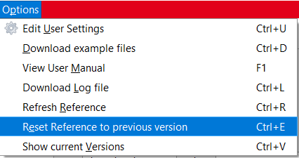
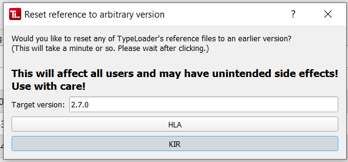
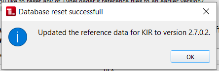
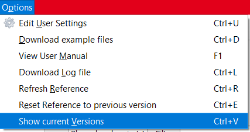
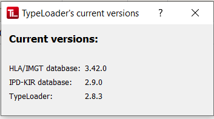

#  Resetting the reference database

During startup, TypeLoader always checks that the most recent version of the reference databases is used. If this is not the case, you are promptet to update the references.

If the reference database appears broken, you can always [=> manually refresh the reference databases](reference.md).

Sometimes, it may be necessary to temporarily use an older database version, though, e.g., during [=> Restart of an allele](restart_allele.md). 

 **If you have multiple TypeLoader users within your organisation, they use a shared reference! So any changes you make will affect them all! Make sure your colleagues are aware you intend to do this, so they do not use TypeLoader until you are finished and have returned the database to the current version!**

**If any of your colleagues start their TypeLoader while you are still working with your deliberately old database version, they will be notified that the current reference version is not up to date and asked to update it. If they confirm this, TypeLoader will update your shared reference and you will *both* be working with the actual current version from that moment on. So really, talk to your colleagues whenever you want to use this feature!** 

## Resetting the reference
To reset either of the reference databases to a version of choice, use the menu `Òptions` => `Reset Reference to previous version` (or `CTRL+E`). 

Then, you can choose which database you want to reset, and to which version:

**Note that the Target version field is a freetext field. It will expect the version to be given in the format `3.38.0` or `3.38` or `3380` etc., without any letters etc., and should complain if you enter something that doesn't comply to this. Make sure you enter the desired version in an understandable format.**

**TypeLoader will always use the latest update of the specified version, so if a 4th field (a.k.a. bugfix) version exists, the latest one is the one TypeLoader will use.**

After entering the desired version, click the `HLA` or `KIR` button, depending on which database you want to update, and confirm your choice.

TypeLoader will then update its reference database to the version you chose, and confirm whether this worked:

## Checking the current database version
To check which database version TypeLoader currently uses, choose the menu `Options` => `Show current Versions` (or `CTRL+V`). 

You will then get a little popup dialog showing you the currently used TypeLoader version as well as the reference database versions:

**These versions are updated whenever any of your organisation's TypeLoader users make changes to the database, either by [=> refreshing the database](reference.md) or by resetting it as explained above.** 

## Returning to the latest database version
After you are done with whatever you wanted to do using the old reference version, **make sure to return TypeLoader to the latest database version**.

To do this, you have 2 options:

- [=> Manually refresh the database](reference.md)
- Close and restart TypeLoader. During startup, it will realize that the currently used database is not up to date and prompt you to refresh to the newest available version.
