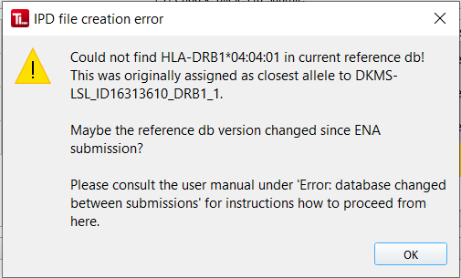

#  Error: database changed between submissions
Sometimes there is a new version of the reference database between an allele's uploading to TypeLoader (which is when ENA submission files are created) and IPD submission of the same allele. 

Normally, this is not a problem. However, it can lead to trouble if the reference allele assigned during allele upload has been renamed meanwhile. In these cases, TypeLoader will throw the following error: 

## How to proceed from here
### (1) Restart the allele
Use the [=> Restart Allele](restart_allele.md) workflow to generate a fresh ENA file for your allele. If convenient, you can use the "Download a file" button of the allele's [=> Sample View](view_sample.md) to download a fasta file with the allele's sequence. Note that this way, you will lose all metadata originally gleaned from the input file, though. Using the original input file is, therefore, usually better.

### (2) Check ENA file for changes
Go to the [=> Sample View](view_sample.md) of the allele and click the [=> View Files](view_files.md) button in the upper right area. Then, compare the newly generated ENA file of your allele (it ends with `.ena.txt`) with its previous version (it has the same filename, but contains the text `_old_` as well as the timestamp of the restart). 

#### (2a) No changes
If the comparison results in "Files are identical", that means that the reference allele was renamed (usually because an intronic variant was added meanwhile) but this has not had any impact on the correctness of your ENA file. 

In this case, you can proceed directly to (3).

#### (2b) Changes found
If the new ENA file differs from the old file, you have to re-submit it to ENA (see [=> Restart Allele](restart_allele.md)) and wait for their approval before you can re-attempt [=> IPD Submission](submission_ipd.md). Depending on the circumstances, it might be easiest to delete the allele at ENA and in TypeLoader, and then start it completely new, as if TypeLoader had never seen this allele. 

### (3) Re-attempt IPD Submission
Normal [=> IPD Submission](submission_ipd.md) should work now.
