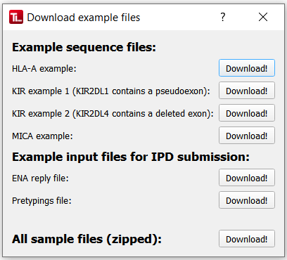

#  Example files

TypeLoader provides a set of example files. With these, you can

 * Test that TypeLoader works in your environment
 * Become familiar with TypeLoader
 * See the file format of the input files and the generated output files

 **Please ONLY use these example files in your [=> TEST account](users_test.md)!** Do **NOT submit** IPD-files generated from them **to IPD!**

## Provided files

### Example sequences
TypeLoader provides fasta files for at least one *existing and officially named* allele sequence per gene system:

 * HLA-A*01:01:01:01: example for an HLA class I sequence
 * KIR2DL1*0020101: example for a KIR gene containing a pseudoexon
 * KIR2DL4*0010201: example for a KIR gene that has a deleted exon when compared to other KIR genes
 * MICA*00201: example for a MICA sequence

Once you have downloaded them to a location of your choice, you can upload them to TypeLoader using the [=> New Allele Dialog](new_allele.md).

 **Please note that the header information is completely optional** (except for any name for the sequence, to satisfy the FASTA file format). Your own sequences *can* follow this pattern, but they don't have to. See [=> Input files](input_files.md) for more details.

### IPD submission files
The creation of files for [=> IPD Submission](submission_ipd.md) requires additional information beside the sequences: an ENA reply file, which contains the IDs assigned by ENA after [=> ENA Submission](submission_ena.md), plus a pretypings file containing the genotyping results for all loci of the samples to be submitted. 

The files provided here work for the sequence files provided, and can be used to create IPD submission files from them. 

## How to get them
Use the menu (`Options` => `Download example files`) or press CTRL+D:

Then, simply click the `Download!` button for any file you would like to download.

The files for IPD submission can be used in the [=> IPD Submission dialog](submission_ipd.md) to create IPD submission files for all provided example sequences.