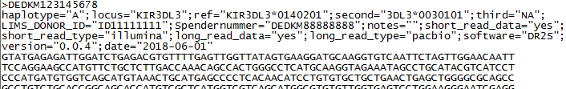
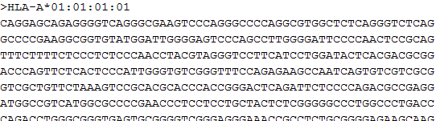

#  Input files
TypeLoader accepts sequences for [=> New Alleles](new_allele.md) in either of two formats:

 * Fasta format
 * XML format produced by NGSEngine (GenDX) 

## Sequence Requirements
See [=> Sequence Requirements](new_allele_requirements.md) to check the minimum requirements for TypeLoader's input sequences.

## Fasta files
Fasta files should contain exactly one sequence. (If they contain more than that, only the first sequence is used. To add multiple fasta sequences at once, use the [=> Bulk Fasta Upload](new_allele_bulk.md).)

 **The files MUST follow FASTA format conventions! (see below)**

**Optionally**, you can use the sequence header to pass data along to TypeLoader, which it will then store for your allele. This should be a list of key-value pairs separated by ";", like in this example:

The following keys are  currently recognized:

 * **locus**
 * **ref**, **second**, **third**, **fourth** (all of these allele names are concatenated with 'or' and stored as "partner_allele")
 * **LIMS\_DONOR\_ID** or **SAMPLE\_ID\_INT** (internal sample ID)
 * **Spendernummer** or **SAMPLE\_ID\_EXT** (external sample ID)
 * **notes** (comment)
 * **short\_read_data** (was short-read data used to generate this sequence, yes/no?)
 * **short\_read_type** (type of short reads used)
 * **long\_read_data** (was long-read data used to generate this sequence, yes/no?)
 * **long\_read_type** (type of long reads used)
 * **software** (software used for full-length genotyping)
 * **version** (version of the software used for full-length genotyping)
 * **date** (date of secondary genotyping)

### Fasta file format
Fasta files are standard text files for sequences. The first line is the header and starts with a ">" followed by the name of the sequence (any name will do) and any additional information separated by a space (see above). The second line and all following lines contain the actual sequence, which ends if the file ends or the next header starts, whichever happens first.

Recognized file endings are .fa and .fasta.

## XML files
The XML file exported from NSGEngine contains both alleles of one locus of one sample. If you upload such a file to TypeLoader, the dialog will ask you to clarify which of the alleles you want to add. (If you want to add both alleles, run the [=> New Allele Dialog](new_allele.md) twice with the same file, and choose the other allele during the second run.)

## Example files
TypeLoader provides [=> example sequences in fasta format](example_files.md) for all gene systems, so you can have a look at the format TypeLoader expects.

