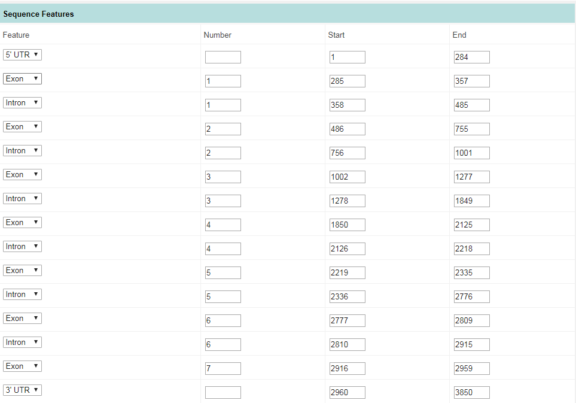

#  IPD Submission via IPD's Web Form

To obtain your IPD submitter ID, you will have to submit at least your very first allele to IPD via their web form. This process also allows you to make sure your workflow is in compliance with their requirements. Note that using this workflow, you have to submit each allele individually.

 **If you only expect to be submitting a few sporadic sequences, it might be easier if you generally use this procedure instead of [=> signing up as a bulk submitter](ipd.md).**

## (1) Create your IPD files with TypeLoader
Use TypeLoader's [=> IPD submission dialog](submissions_ipd.md) to generate your IPD files. (You do not have to do this, but this way you can harness at least TypeLoader's annotation power to get the correct sequence annotations and comparison to the closest known allele.)

## (2) Open the web form
Go to [the HLA submission website](https://www.ebi.ac.uk/ipd/imgt/hla/subs/submit.html) or [the KIR submission website](https://www.ebi.ac.uk/ipd/kir/submit_stage_1.html), as appropriate for your allele. Click ``Start your submission here``.

 **The following instructions are for the HLA submission tool as of January 2019. The KIR submission tool is quite similar, but the wording and order of steps differs in some places. Also, updates by IPD may have changed the HLA submission tool meanwhile, but the general idea should still remain the same.**

## (2) Check Submission Checklist
Go through the checklist provided and **make sure your workflow satisfies all these requirements**.

Note that NGS approaches generally satisfy the "sequenced in isolation" requirements if continuous phasing of the alleles has been achieved.

Once you have rightfully checked all boxes, click ``Proceed to next step``.

## (3) Enter your contact details
Enter your contact details (use the upper part if you already have a submitter ID, else use the more elaborate lower part) and click ``Submit`` to continue.

## (4) Enter Basic Sequence Information
Open the TypeLoader-generated IPD submission file of the allele you want to submit in a text editor of your choice or directly in TypeLoader via the [=> Sample View](view_sample.md) => ``Edit a file`` option. (The IPD file is the one that starts with your Company Shortname for IPD, as provided via your [=> Settings](settings.md)).

### Local name:
This is contained in the line starting with DE (or you can copy it from TypeLoader's "Allele Name" field in the [=> Sample View](view_sample.md)).

### Sequence Type:
Depending on what locus your allele belongs to, choose "Class I - Genomic" or "Class II - Genomic" (or "Full Length Genomic" for KIR).

### Accession Number(s):
The ENA accession number is contained in the IPD file line starting with "DR&nbsp;&nbsp;&nbsp;GenBank" - you want the ID given after the semicolon (without the space or dot):

```
DR   GenBank; ENAAccessionID.
```

Then click ``Continue``.

## (5) Enter Submission Reference Details

If you have a publication to go with your allele, this is where you enter the details about this paper. Otherwise, choose "Unpublished".

Then click ``Continue``.

## (6) Submit Nucleotide Sequence and Sequence Features

### (a) Sequence Alignment

#### Please Select Locus:
Please choose your allele's locus from the dropdown list.

#### Closest known allele:
You will find this in your TypeLoader-created IPD submission file in the line starting with CC.

E.g.,:

```
CC   HLA-B*08:new differs from HLA-B*08:01:01:01 like so : Mismatches = pos 319 in codon 83 (GGC -> CGC);.
```

In this case, the closest known allele is HLA-B*08:01:01:01.

### (b) Written description

You will find this in the same line as the closest known allele. Just copy the whole line or paragraph into this section (removing the "CC&nbsp;&nbsp;&nbsp;" part, of course).

### (c) Sequence Features
You will find the sequence features of your allele in the last lines starting with "FT&nbsp;&nbsp;&nbsp;". The part you want for this will look approximately like this:

```
FT   5'UTR          1..284
FT   Exon           285..357
FT                  \number="1"
FT   Intron         358..485
FT                  \number="1"
FT   Exon           486..755
FT                  \number="2"
FT   Intron         756..1001
FT                  \number="2"
FT   Exon           1002..1277
FT                  \number="3"
FT   Intron         1278..1849
FT                  \number="3"
FT   Exon           1850..2125
FT                  \number="4"
FT   Intron         2126..2218
FT                  \number="4"
FT   Exon           2219..2335
FT                  \number="5"
FT   Intron         2336..2776
FT                  \number="5"
FT   Exon           2777..2809
FT                  \number="6"
FT   Intron         2810..2915
FT                  \number="6"
FT   Exon           2916..2959
FT                  \number="7"
FT   3'UTR          2960..3850
```

**How to read this:**

 - Each UTR is given in one line, with its start and end position
 - Each exon or intron has 2 lines: the first line gives its start and end position, the second line gives its number
 
So this example allele has 15 sequence features: 2 UTRs, 7 exons, and 6 introns.

#### Input Sequence Features:
Choose "Manual Assignment of Features".

#### Number of Features:
Count your sequence features (both UTRs plus all exons plus all introns) and write the number into this field (15 in our example).

 **Especially for KIR, COUNT THEM! Do NOT just add the numbers of the highest-numbered exon and intron. Several KIR genes have pseudo exons or deleted exons, so your overall number of exons and introns may be lower than calculated if you assume that all exons and introns will be present. Counting is always the safe option.**

### (d) Nucleotide Sequence Features

This field asks for the complete sequence of your allele, without any annotations. Since your IPD submission files only contains the annotated sequence, it is best to get this from the fasta file. Either use the original fasta file, or open it directly in TypeLoader via the [=> Sample View](view_sample.md) => ``Edit a file`` option. (You want the file that ends with .fa or .fasta. If your original file was a GenDX .xml file, TypeLoader has created a fasta from that, and you will find it in the same place.)

From this file, copy the whole sequence **without the the header line** (which starts with "<") into the field of the IPD web form.

Then click ``Continue``.

## (7) Sequence Features
Here, you will have to copy the start and end positions of each sequence feature, which you can find in your TypeLoader-generated IPD submission file (see section 6c).

In the end, the filled-out form should look something like this:


Then click ``Continue``.

## (8) View and Edit Sequence Features

You are now presented with a generated form of your input for the sequence and feature annotations. Cross-check this with your TypeLoader-generated IPD submission file, it should be identical to the relevant sections. 

Then click ``Continue``.

## (9) Information on the Source Cell or Individual

Fill out the form with all the information you have about the sample your allele stems from.

### Cell/Individual ID/Code:
Use TypeLoader's Cell Line for this field. You can find it in the [=> Sample View](view_sample.md) in the "General Information" table (upper left corner).

Once you have everyhing filled out, click ``Continue``.

## (10) Source Sample Typing Profile
Fill out the form with the known genotyping results of the other loci of your sample. You can copy these from your TypeLoader-generated IPD submission file (they are listed in lines starting with "FT&nbsp;&nbsp;&nbsp;", in the "FT&nbsp;&nbsp;&nbsp;source" section, directly above "FT&nbsp;&nbsp;&nbsp;method"). Copy these into the "HLA DNA Typing" part of the form.

E.g., if you have the line 

```
FT                  /HLA-A*="01:01:01G,30:02:01G"
```

you should copy ``01:01:01G,30:02:01G`` into the field for HLA-A.

 **Be careful with the order of loci!** The IPD web form does not list them alphabetically, while TypeLoader does!

 **It is mandatory to provide genotyping results for HLA-A, -B and -DRB1 as well as the locus of your novel allele. The rest are strongly encouraged, though.**

Once you have everyhing filled out, click ``Continue``.

## (11) Methods
Fill out the form with the appropriate data about your workflow.

Note that adding the primer sequences is optional (which is why TypeLoader does not ask for them).

**Clicking ``Submit`` will finish your submission.**