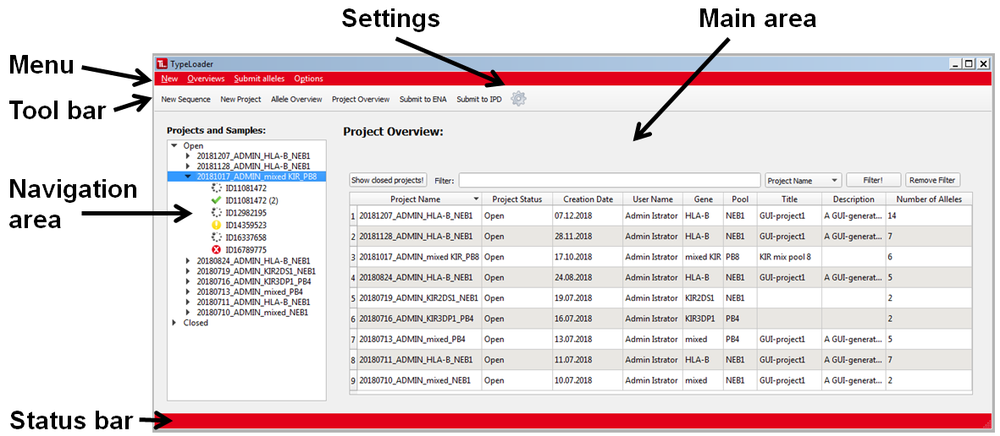

#  What is where in TypeLoader?

TypeLoader's GUI is diveded into different parts. 

On the top, you have the menu bar and the tool bar to choose what you want to do:

 * [=> Adding new alleles](new_allele.md)
 * [=> Adding new projects](new_project.md)
 * View an [=> Overview](overviews.md) or [=> Detailed View ](detailed_views.md)
 * [=> Submit alleles to ENA](submission_ena.md)
 * [=> Create files for IPD submission](submission_IPD.md)
 * [=> View or change your settings](settings.md)

(Each of these can be accessed via menu bar or tool bar, or by using the keyboard shortcuts displayed in the menu.)

Below these bars, you find the main area which displays the [=> Overview](overviews.md) or [=> Detailed View ](detailed_views.md) you have currently selected. 

With the [=> Navigation area](navigation.md) on the left side, you can choose the project or sample you want to work on.