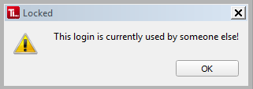
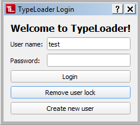

#  User Locks

Multiple people logging into TypeLoader with the same login at the same time, or the same user logging in simultaneously from several computers, can lead to corrupt databases. To prevent this, TypeLoader creates a .lock file for your user account whenever you log in. When you close TypeLoader, this file is removed.

If TypeLoader should crash, the lockfile is sometimes not removed, which prevents logging into the account with a fresh TypeLoader session. In this case, you get an error message when trying to log in:

 

If you are sure the lockfile is there because of this (and not because someone else is actually using that login right now), you can remove the lockfile using the "Remove user lock" button on the login dialog:

(This button is only enabled after a lockfile has been found.)

TypeLoader will then ask for confirmation, and if you do confirm, will remove the lockfile so you can log in again.