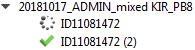

#  Multiple target alleles from one sample 

TypeLoader can handle multiple target alleles from one donor. These can be part of the same project or multiple projects.

 **Please note that TypeLoader will only recognize alleles belonging to the same sample _within the same user account_.** Please make sure the alleles of one locus of a sample are handled by the same user, otherwise both alleles may get the same local-name and IPD will complain.

##  Recognition 
TypeLoader will identify target alleles as belonging to the same sample if they have *the same internal donor id*.

##  Consequences 
Adding a new target allele with the same internal sample ID as a known sample will lead to TypeLoader automatically recognizing this fact. 

 **After the first allele, the external sample ID given is ignored.**

Alleles within one sample get a number which is automatically incremented by the order in which they were uploaded to TypeLoader. 
This number can be found in the field "Allele Nr. in Sample" in the [=> Sample View](view_sample.md) (Allele Details table in the lower part, tab "General").

###  Navigation Area 
In the [=> Navigation Area](navigation.md), any target alleles with an allele number > 1 have this number denoted in brackets:

###  SampleView 
In the [=> Sample View](view_sample.md), all target alleles of the same sample are listed in the alleles table in the upper right area, with their respective projects:

They are ordered by their allele number (and hence the order in which they were uploaded), NOT by their locus. (You find this number as part of the column "Target allele".) If needed, you can sort by or filter on any of the columns, though.

You can also click any of these alleles to investigate them in the Allele Details area below.
