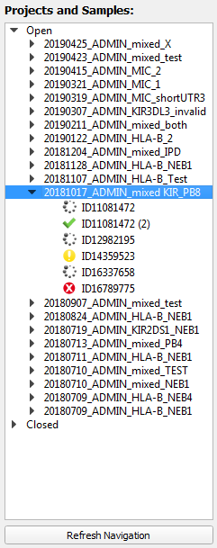

#  Navigation Area 

The left panel of TypeLoader's GUI is a navigation area which shows the structure of all projects and target alleles of the user logged in. It can be used to navigate between these items.

All items are displayed hierarchically:

  * **Status-category** (order: "Open" first, "Closed" second)
  * **Project** (ordered reversed alphabetically, so newest first)
  * **Target allele** (ordered alphabetically)

All target alleles are marked with an icon showing their current allele-status category. (For details, see [=> Colors, icons and status](colors_icons.md).)

Target alleles are named for their internal sample ID. If there are more than one target alleles derived from the same sample, these are indicated by ``(nr)`` following the sample ID (if nr > 1). 

##  Expanding or collapsing 
By default, when opening TypeLoader, the "Open projects" category is expanded while "Closed projects" are collapsed.

All items that have sub-items (= categories that have projects and projects that have target alleles) can be expanded. This is marked by a black triangle mark in front of the item. Clicking this triangle or double-clicking the item itself will expand the item.

##  Selecting an item 
To select a sample or project as your current item of interest, simply click it.

##  Viewing an item 
To view and/or edit details about a **project**, rightclick on it and select ``Open Project View``. This will open the [=> Project View](view_project.md) on this project. 

If the Project View is already open, you can switch between projects by just clicking them in the Navigation Area, and the Project View will be refiltered to the newly selected project.

To view and/or edit details about a **target allele** or its sample, rightclick on it and select ``Open Sample View``. This will open the [=> Sample View](view_sample.md) on this project. 

If the Sample View is already open, you can switch between target alleles by just clicking them in the Navigation Area, and the Sample View will be refiltered to the newly selected target allele.

(The additional option ``Delete Sample`` is meant for administrators only and requires a password to avoid data corruption.)

