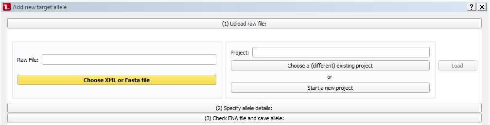
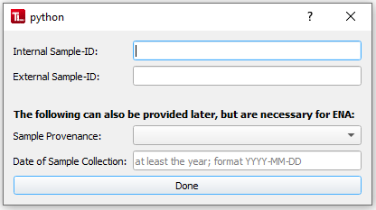
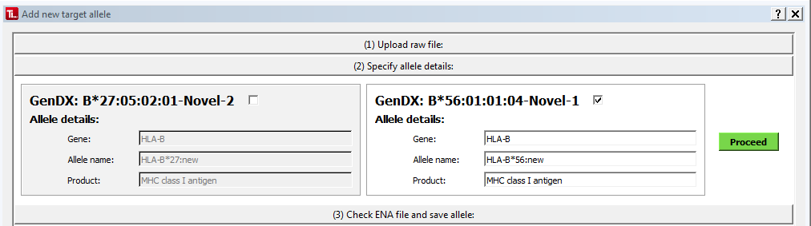
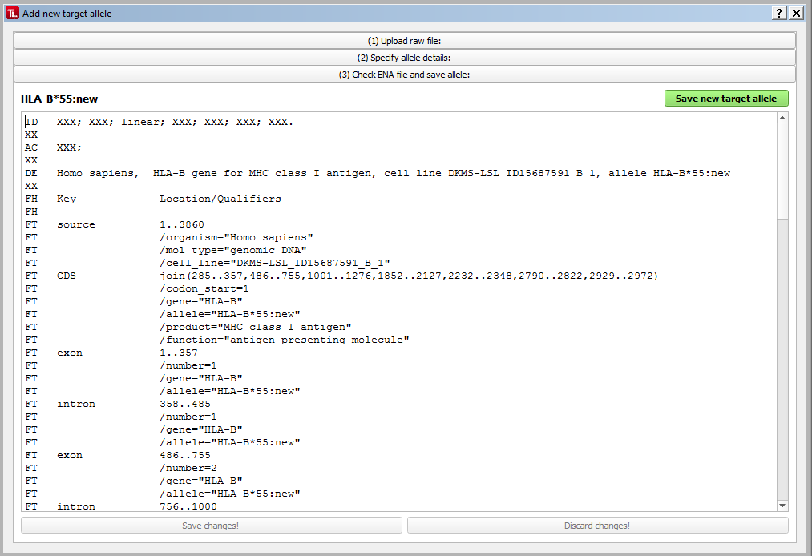

#  Adding a new allele 
TypeLoader organizes its sequences in projects, which are a set of sequences with a common trait, e.g., a sample pool. This is neccessary, both to keep organized and also because ENA only accepts projects, not single sequences. 

To add a new target allele (A.K.A. sequence) to TypeLoader,  choose the option "New Sequence" in the menu or task bar. This will open the New Allele dialog:

##  (1) Uploading a sequence file 
First, click "Choose XML or Fasta file" and choose the sequence file you wish to upload. This can either be a fasta file or an XML file like those generated by NGSEngine (see [=> Input Files](input_files.md)).

Then, choose the project this sequence should belong to. If you have already selected a project prior to calling this dialog, this project is already pre-selected. If there is no project selected or you want a different project then the selected project, click "Choose a (different) existing project". If you have not started the project, yet, you can also click "Start a new project", which will open the [=> New Project Dialog](new_project.md).

Once you have entered a sequence file and a project, you can click the now green "Load" button. TypeLoader will then upload and read this file, which can take a bit.

Once the file has been uploaded, TypeLoader will take you to the next step.

###  (1a) Specifying the sample 
If TypeLoader does not find the sample's ID in the raw file (it can be provided via a fasta sequence's header or in the XML file), it will generate a popup dialog requesting you to enter the sample's ID:

Here, you enter the sample's internal ID ("Lims donor ID") and external ID ("Spendernummer") and click "Done" to proceed.

##  (2) Specifying allele details (for XML files) 
If the uploaded file is a GenDX NGSEngine file, it contains multiple alleles of one locus. TypeLoader will ask you to specify which allele you want to upload, and to give a unique cell line identifier:

Select one of the alleles by using the checkboxes.

If one allele is marked by NSGEngine as "novel", it is auto-selected. 

Check the data entered and provide a cell line in the appropriate box. 

 The cell line must be formatted **lab-locus-nr** (or at least like "[something]-[something]-[something]" if it's just a test upload) and be unique.

 TypeLoader will check the cell line's uniqueness _for this account_ before saving the allele, and complain if it's not unique. However, since ENA requires this field to be absolutely unique, you have to make sure yourself you're not using a cell line of another user!
</WRAP>

Once you have selected an allele and entered a cell line, you can click "Proceed" and TypeLoader will take you to the next step.

##  (3) Check ENA-text and save results 
###  (3a) Check ENA text 

Once TypeLoader knows which allele you want to upload, it will automatically annotate the sequence and generate the text file needed for ENA submission. This text is displayed for your information:

You can edit the text and use the "Discard changes!" / "Save changes!" buttons on the bottom to decide whether to discard or save your changes.

###  (3b) Changing the cell line 
 **If you want to change the cell line, DO NOT change it in the ENA text!**

Instead, change it in the field labelled "Cell line" over the ENA text field and click "Change cell line". TypeLoader will then adjust the ENA text for you. This makes sure all changes are consistent.

###  (3c) Saving the target allele 
Once you're satisfied with the ENA text and the cell line, click "Save new target allele".

TypeLoader will then save the ENA text as a file and all the details you have entered plus those inferred from the raw file to its database. 

#### Default values
By default, the following values are set:

  * goal: novel
  * allele status: ENA-ready
  * lab status: completed

For NGSEngine XML files, the following values are set additionally:

  * long read data: yes

For DR2S files which provide "software: DR2S" in their header, the following values are set additionally:

  * long read data: yes
  * long read phasing: yes

All of these can later be edited in the AlleleView.

Once TypeLoader finishes this, the dialog is closed. Now you can find the allele in the [=> Navigation Area](navigation.md) and view and edit its data in its [=> Sample View](view_sample.md).

##  Adding multiple alleles of one sample 
You can add multiple alleles of one sample one by one by specifying the same internal and external user ID.

These can be entered from the same raw XML file by uploading one allele, then uploading the same file again but choosing the other allele. Alternatively, a different raw file can also be used.

For more details see [=> Multiple alleles of one sample](multiple_alleles.md).

##  Alternative 
If you have several new fasta files you want to upload, you can use the [=> Bulk Fasta Upload](new_allele_bulk.md) instead.