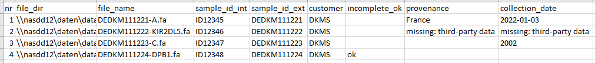
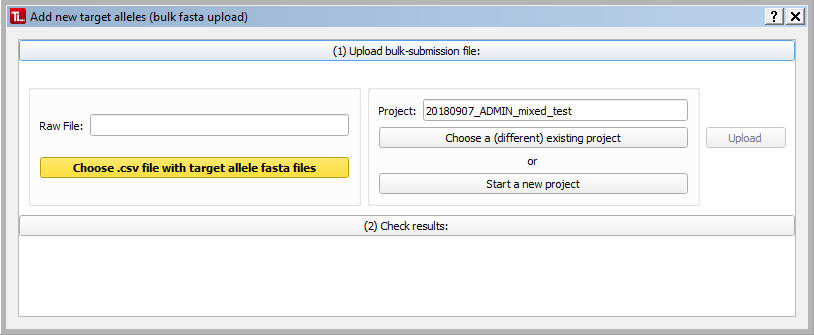
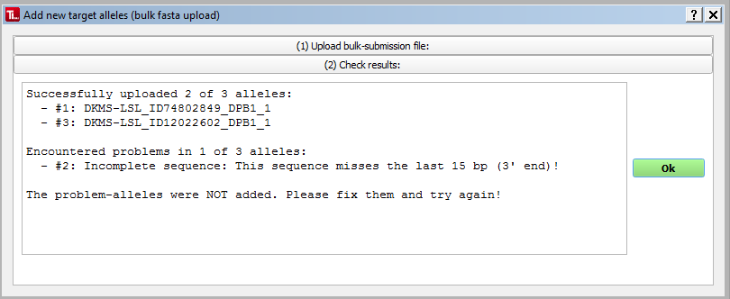

#  Bulk Fasta Upload 
If you have a lot of **fasta files** you want to upload to TypeLoader, you can use the Bulk Fasta Upload. 

 **This feature does not work for XML files!**

This feature uses a .csv file specifying the files to upload and their sample data.

 Please note that - unlike the [=> New Allele Dialog](new_allele.md) - this dialog will **not** show you the created ENA text files. To check these, you have to visit each allele's [=> Sample View](view_sample.md) and use the ``Edit a file`` button. 
**Therefore, we recommend not using this feature until you have gotten familiar with adding individual alleles using the [=> New Allele Dialog](new_allele.md).**

##  The bulk upload csv 
To give TypeLoader the files you want to bulk-upload, you need a .csv file containing the files to upload as well as their sample information. It must be comma-separated and contain the following columns (with one row per target allele to upload):

  * **nr**: an identifier for this line; it must be a unique number and should be incremented. TypeLoader will use this number to give you feedback whether this allele was successfully uploaded or not.
  * **file_dir**: the directory where the fasta file is located
  * **file_name**: the file name of the fasta file you want to upload
  * **sample\_id_int**: the internal sample ID for the sample 
  * **sample\_id_ext**: the external sample ID for the sample
  * **customer**: (optional) the customer who issued the sample

The customer will be added to the database if provided, or left empty if not.

##  Performing a bulk fasta upload 
To use this feature, use the Menu to choose ``New`` => ``New sequences (bulk fasta upload)``. This will open the New Allele Bulk Upload-dialog:

###  (1) Upload bulk files
Use the ``Choose csv file with target allele fasta files`` button to choose your .csv file.

Use the panel on the right side to choose an existing open project or start a new one.

After clicking ``Upload``, TypeLoader will ask you to confirm that you really want to proceed:

Clicking ``Yes`` will start the bulk-upload of your target alleles.

 **Bulk-upload takes a while (depending on the number of files you want to upload as well as their size and your computer). The confirmation box will remain visible until all files have been processed.**

After all alleles have been processed, the confirmation box will vanish and the next section will expand to show you the results:

###  (2) Check results 

This section shows you the result of your bulk submission. 

First, all alleles that were successfully uploaded are listed. These are now contained in the specified project.

Then, all alleles that produced any kind of error or problem are listed, together with the error message. These were not added to TypeLoader. You will need to fix these before you can upload them.

Clicking ``Ok`` will close the dialog.
