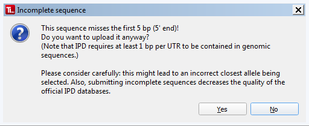

#  Sequence Requirements

Input sequences for TypeLoader need to fulfill the following requirements:

## Loci: HLA, KIR or MIC
Each file must contain **the sequence of one allele** of one of the following genes:

 * HLA: any class I or class II gene
 * KIR: any of the (human) KIR genes or pseudogenes recognized by IPD-KIR
 * MIC: MICA or MICB
 
## Full-length genomic sequences
 **TypeLoader DOES NOT TRIM the sequences for you, you have to do this BEFORE uploading!**

 * All sequences **must** be **genomic** sequences (i.e., no cDNA sequences or ARD-only sequences)
 * All sequences **must** cover **all exons AND all introns** (i.e., no partial sequences)
 * All sequences **must** cover **at least 1 bp of each UTR**.
 * **Ideally**, sequences should start at the **first base of the official 5' UTR** and end at the **last base of the official 3' UTR**. Less is possible, if the requirements above are met (i.e., parts of the UTRs can be missing). **Any additional adjacent sequence parts must be trimmed before uploading!**

### Incomplete UTRs
IPD does not accept partial genomic sequences. However, they consider a sequence full-length if it contains at least the last base of the 5' UTR, the first base of the 3' UTR, and all exons and introns in between. Therefore, this is TypeLoader's minimum requirement for any input sequence.

TypeLoader normally expects sequences to cover the whole gene including both UTRs completely. If it gets a sequence with only partial UTRs, it throws a warning and asks you whether you are sure you want to proceed:

By clicking `Yes`, you confirm that you are aware your sequence is incomplete, and of the possible consequences of submitting such a sequence, and that you want to upload and eventually submit it, anyway.

 **Please consider carefully if you really can't provide a full-length sequence covering the whole gene, including both UTRs!** Incomplete sequences in the IPD databases often cause problems for NGS-based genotyping and other analyses, so it is *highly* preferable to submit only complete sequences to IPD.

(If either of the UTRs, or more than that, is completely missing, TypeLoader will reject the sequence.)

## Example sequences
TypeLoader provides [=> example sequences](example_files.md) for all gene systems, so you can have a look at the format TypeLoader expects.