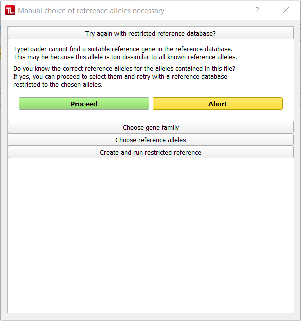

#  Unusual new alleles
Sometimes, TypeLoader does not automatically find the correct closest known allele of a target allele. This can happen if the correct reference allele is very dissimilar to other known alleles of the same gene and especially if it is not known at full length. In these cases, the alignment score that TypeLoader uses to identify the closest known allele is negatively biased and the correct reference allele not found.

This is no problem if another suitably close full-length allele can be found. In these cases, TypeLoader will use this other allele as reference and not bother you about anything.

However, if no suitably close full-length allele can be found, TypeLoader will not be able to automatically upload this allele. However, if you know the correct reference allele (e.g., from the software you used to analyze the allele prior to uploading it to TypeLoader), then you can tell TypeLoader the correct reference alleles and TypeLoader will probably be able to handle your allele.

## (1) The "Upload with restricted reference" dialog

If TypeLoader does not find a suitable full-length reference allele, the following dialog pops up:

To try uploading your target allele, click ``Proceed``. If you don't want to go forward (or if your reference didn't work and the dialog popped up again), click ``Abort`` to return to the [=> New Allele dialog](new_allele.md).

## (2) Choose the right gene family

In the next section, choose which gene family your allele belongs to, then click ``Proceed``.

## (3) Chose the reference allele(s)

In this section, you will find a list of all possible reference alleles. This should include all full-length alleles of the gene family you selected in the previous section.

You can either scroll down the list, or use the filter above the list - any part of an allele name works (e.g., "B*35:" etc.). Emptying the filter field and clicking ``Filter!`` again will unfilter everything again.

Either way, click all alleles you want to use as a reference to select them. **Make sure you select a reference allele *for each allele in your file*!** If you are uploading an XML file generated by NGSEngine, that usually means you need **2 reference alleles**, one for each allele present! Of course, you can filter the list for each one separately.

You can always check the number of currently selected alleles in the field right below the allele list. 

Repeated clicking on an allele will select and deselect it. Use the ``Unselect all!`` button to remove all selections and start this section again.

Once you have all necessary reference alleles selected, click ``Proceed``.

## (4) Confirm chosen reference alleles

In this section, you are presented with the reference alleles you have selected in the previous section. 

If this is not what you expected to see, use the ``Return to allele choice section`` button to correct your choices.

If the list is correct, click ``Proceed``.

TypeLoader will then create a reference database containing only the selected alleles, and try uploading your file using only this reference. If it works, the dialog will close and you will return to the appropriate step in the [=> New Allele dialog](new_allele.md). If not, the dialog will pop up again and you can either try again with a different reference allele selection (maybe check that the reference alleles you entered were actually correct?), or TypeLoader cannot currently handle this file. (In that case, please consider [=> getting in touch with us](https://github.com/DKMS-LSL/typeloader/issues) so we can see if we can't get this fixed!)

## Consequences

Once you save an allele using a restricted database, the alleles used as reference are stored as a comment in this allele's metadata. You can find this using the [=> Sample View](view_sample.md) of your allele, on the bottom of the ``Lab Processing`` tab of the ``Allele Details`` area: 

This (and being able to handle the allele at all) is the only consequence of using a restricted reference to upload a new allele. Specifically, there are no marks of this process on the generated files for ENA or IPD, since neither of these institutions cares about this.