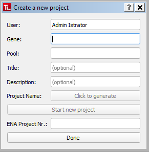

#  Creating a new project 

TypeLoader organizes its sequences in projects, which are a set of sequences with a common trait, e.g., a sample pool. This is neccessary, both to keep organized and also because ENA only accepts projects, not single sequences. (If needed, a project can contain only one sequence, though.)

So, to upload a sequence to TypeLoader, you must first create a project.

To do this, choose the option "New Project" in the menu or task bar. This will open the NewProject dialog:

##  (1) Enter project details

To start a new project, you must give the following details:

* **User:** This is the full name of the user starting this project. TypeLoader will automatically enter the name associated with the logged in user account. The associated initials are later used for the project name. You can also enter a different name - then the initials for the project name will be inferred from the full name given here.
* **Gene**: This is the gene the sequences of this project belong to. If the project will cover several loci, use "mixed".
* **Pool**: The name of the sample pool or experiment.
* **Title**: Optionally, you can give your project a title. This will be stored and reported to ENA, and can be usefull for filtering the [=> Projects Overview](overview_projects.md). Keep it short and concise.
* **Description**: Optionally, you can give your project a description. This will be stored and reported to ENA, and can be usefull for filtering the [=> Projects Overview](overview_projects.md). Keep it short and concise.

##  (2) Generate project 
After all details have been entered, click the green "Click to generate" button. TypeLoader will then generate the project's name as follows:

**Date_User initials\_Gene\_Pool**

If the name is already in use (because the same user already started a project with the same parameters on the same day - which normally should not happen), you get a warning asking you to change the pool name. Afterwards, click the "Project name"-Button (now displaying the previously generated project name) again to generate a new name.

##  (3) Register project with ENA 
Now the project must be registered with ENA. To do this, click the now green ``Start new project`` button.

TypeLoader will then automatically submit the project's details to ENA and retrieve the project ID that ENA generates. This project ID is then displayed as "ENA project nr":

Your project has now been created successfully and you can close the dialog (either using the ``Done`` button or the X in the upper right corner).

The new project will appear in the [=> Navigation area](navigation.md) and [=> Projects Overview](overview_projects.md) and is automatically selected as current project.

Now you can add sequences to your project using the [=> New Alleles Dialog](new_allele.md).