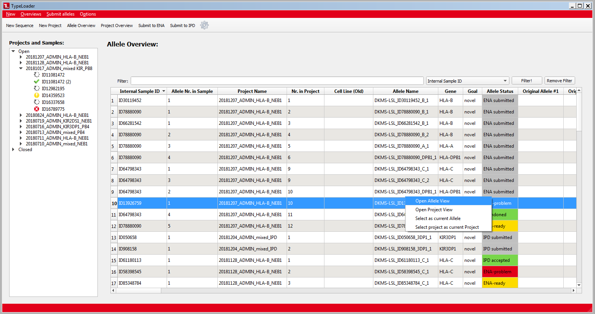

#  Allele Overview 

This [=> Overview](overviews.md) shows all target alleles of the TypeLoader account logged in (1 row per allele). Just like the [=> Project Overview](overview_project.md), this table can be sorted and filtered by all columns.

Cells in the columns ``allele status`` and ``lab status`` are [=> color-coded](colors_icons.md).

Rightclicking any row will give you the following options:

  * **Open Allele View**: opens this target allele in the [=> Sample View](view_sample.md), where its data can be inspected and edited.
  * **Open Project View**: opens the project this target allele belongs to in the [=> Project View](view_project.md), where  its data can be inspected and its status changed.
  * **Select as current allele**: chooses this target allele as current allele. The selection in the [=> Navigation Area](navigation.md) will jump to this allele and expand its project, if necessary. (The effect is the same as clicking the allele in the [=> Navigation Area](navigation.md).)
  * **Select project as current project**: chooses this target allele's project as current project. The selection in the [=> Navigation Area](navigation.md) will jump to this project and expand it, and it will be pre-selected as default when opening a dialog. (The effect is the same as clicking the project in the [=> Navigation Area](navigation.md).)

 The larger your database of existing alleles, the bigger this table becomes. Currently, this makes it a bit slower to display, once you have a few hundred alleles in your account. (This delay happens only when you open this view, and only the first time during a given TypeLoader session.) We are aware of this, and looking to fix it eventually, albeit not with high priority.