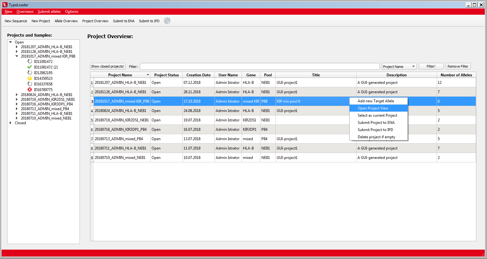

#  Project Overview 

This [=> Overview](overviews.md) shows all projects of the TypeLoader account logged in (1 row per project). Just like the [=> Allele Overview](overview_alleles.md), this table can be sorted and filtered by all columns.

By default, only projects with status "Open" are displayed. To also see closed projects, click the ``Show closed projects!`` button in the upper left corner. (Clicking again will hide them again.)

Rightclicking any row will give you the following options:

  * **Add new target allele**: opens the [=> New Allele Dialog](new_allele.md), with this project pre-selected..
  * **Open Project View**: opens this project in the [=> Project View](view_project.md) where its data can be edited.
  * **Select as current project**: chooses this project as current project. The selection in the [=> Navigation Area](navigation.md) will jump to this project and expand it, and it will be pre-selected as default when opening a dialog. (The effect is the same as clicking the project in the [=> Navigation Area](navigation.md).)
  * **Submit project to ENA**: opens the [=> ENA Submission Dialog](submission_ena.md), with this project pre-selected.
  * **Submit project to IPD**: opens the [=> IPD Submission Dialog](submission_ipd.md), with this project pre-selected.
  * **Delete project if empty**: delete an accidentally started project that does not contain any alleles, yet. (Please, use this option with caution. The deleted project will still remain registered with ENA and clutter up their data, and they will probably eventually enquire about it!)