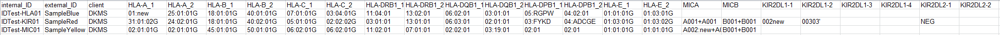

#  The pretypings file

For every submitted allele, IPD requires, among other data, genotyping results for several loci to characterize the sample the novel allele originated from ("Source Sample Typing Profile"). To pass this information to TypeLoader, you add it as a .csv file during [=> IPD submission](submission_ipd.md).

You can fill this file either manually or automatically, if your LIMS etc. provides such functionality.

## Required loci
The following loci are the minimum acceptable pretyping profile:

**[Submissions to IMGT/HLA](https://www.ebi.ac.uk/ipd/imgt/hla/submission/) (i.e., HLA and MIC alleles):**
 * HLA-A
 * HLA-B
 * HLA-DRB1
 * the gene you are submitting

**[Submissions to IPD/KIR](https://www.ebi.ac.uk/ipd/kir/submission/) (i.e., KIR alleles):**
  * all KIR loci except for the pseudogenes, at least on presence/absence level. (i.e., KIR2DL1 - 5, KIR2DS1 - 5, KIR3DL1 - 3, KIR3DS1)
  * the gene you are submitting on allele level 

However, **IPD strongly encourages adding as much additional genotyping data about the sample as you have.**

## The file
The pretypings file must be a .csv file (comma separated text file). You can generate these from Excel or any text editor. **The delimiter used must be comma or semicolon.**

The file should contain **one row per sample you want to submit alleles from**. 

Example file:

### Columns:
  * **sample\_ID\_int**: internal sample ID; **this column is used to identify the sample**
  * **sample\_ID\_ext**: external sample ID; optional (can be left blank but **NOT** deleted!); alternatively, this column can be used to store any additional information; TypeLoader ignores the content of this column
  * **client**: optional (can be left blank but **NOT** deleted!); the customer who sent this sample; this information is saved in TypeLoader, if given

**This is followed by several columns per locus:**

* **HLA loci:** 2 columns per locus (one per allele), "HLA-A\_1", "HLA-A\_2" etc. (genotyping results should be at maximal resolution available and contain no locus)
* **KIR loci:** 4 columns per locus (one per possible allele), "KIR2DL1-1", "KIR2DL1-2" etc. (genotyping results should be shortened to 2 field (=5 digit) resolution or be given as POS/NEG for absence/presence. If needed, a GL-string for all alleles of a gene can be placed in that gene's first column. Cells that are not needed should be left blank). **Please list the KIR2DL5 genes separately, i.e., "KIR2DL5A-1", "KIR2DL5A-2"..., "KIR2DL5B-1"... etc.!**
* **MIC:** 1 column for each gene, called "MICA" and "MICB", each containing **all** alleles for the gene, separated by a "+", each starting with the MIC-letter (e.g., A001+A002, B001+B001)

 **You can leave out/delete any columns that you don't genotype, as long as the required loci (see above) are provided.**

 **If you are using Excel etc. and any of your genotyping results consist only of numbers or something Excel might think is a time or a number, please use single quotes around them to ensure Excel doesn't cut off the leading zeros or otherwise wrecks it!** (I.e., enter the allele `00105` as `'00105'`, or Excel will convert that to `105`.)

 **You can download an example file with the right format and headers from TypeLoader's menu: ``Options`` => ``Download example files`` => ``Pretypings File``. You can use this as a template to fill in your data, either manually or from your LIMS etc.**

### Formatting and resolution

* Use one field per allele (except for MIC). To accomodate for possible copy numbers, HLA-loci have 2 columns and KIR loci have 4. Leave fields, for which you have no genotyping results or which are not needed (not present KIR copies) blank.
* All genotyping results should be given at the highest resolution you can provide (except for KIR, which should be restricted to 2 fields / 5 digits). 
* For KIR genes, POS (presence) and NEG (absence) are valid typing results **except for the target locus**, where allele level resolution is mandatory. 
* **Mark all novel alleles as new like this:**
 * HLA: 003:new
 * MIC: 003:new
 * KIR: 003new (**no colon**, as the KIR nomenclature doesn't use them)

 **If you submit an allele for a locus containing *more than one novel allele*, mark BOTH of them as new. Make sure the fields "Target Allele" and "Partner Allele" in the [=> Sample View](view_sample.md) tab "New Genotyping" of each allele corresponds with your pretypings (in the SampleView, only the respective target allele should be marked as new, the partner allele should be left at first field resolution).** (See [=> Multiple novel alleles](multiple_alleles.md))

### Requirement checks
After you upload the pretypings file, TypeLoader checks the given pretypings for the following requirements, and shows a popup asking you to clarify if necessary:

#### Invalid pretypings
If any of the following things happen, TypeLoader will recognize the pretyping as invalid:

* POS is contained in the pretyping of the target locus.
* None of the alleles of the target locus are marked as new even though this is not a confirmatory sequence (= identical to an already known full-length sequence).
* The closest known allele is not contained in the pretypings of the target locus. (This is quite common if your pretypings were not created with the most recent database version.)
* Pretypings for any of the required loci are missing.
* Any locus except KIR contains a GL string including a phasing (recognized by containing a '|' character). IPD does not accept these, except for KIR genes in KIR submissions.

If any of these are encountered, TypeLoader will show a popup dialog listing all affected samples from this submission, with the encountered problem:

If this happens, you have to adjust the pretypings file accordingly. Then you can try again.

#### Multiple novel alleles in the target locus

If any of the target alleles in your submission are from samples with more than one novel allele in the target locus, TypeLoader will try to figure out which of these pretypings belongs to which target allele by comparing the content of "Target allele" and "Partner allele" in the [=> SampleView](view_sample.md) (lower half, tab "New Genotyping") to the provided pretypings (these values are extracted from the original Fasta or XML file during [=> New sequence file upload](new_allele.md)).

If these do not match, TypeLoader will show you a popup dialog asking for each unclear target allele, which of the provided pretypings belongs to this target allele:

After you click ``Save choices``, TypeLoader will save the results of your choice in the aforementioned fields and re-attempt creating the IPD files, which should work now. 

(TypeLoader needs this information in order to properly format the IPD file in accordance with IPD's wishes.)
