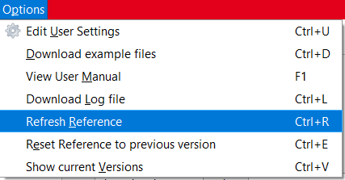
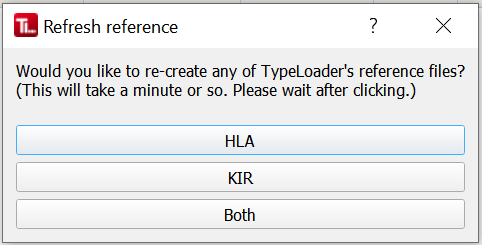

#  Reference updates

## Sources
TypeLoader uses the reference files provided by IPD-IMGT/HLA and IPD-KIR as reference for your alleles. Since their latest releases sometimes contain errors that can lead to weird behaviour and even crashes of TypeLoader, TypeLoader does not use the provided data directly, but has its own mirrors of these files. These are updated slightly after official IPD releases, when a consistency check has been performed by DKMS LSL.

TypeLoader automatically uses the newest version of these LSL-approved reference files. It checks for new versions at each startup, and if it finds a newer version, will prompt you to refresh its reference database accordingly.

**It is strongly advised to always update the reference when TypeLoader suggests this!**

## Manual reference updates
If you suspect your reference may be broken, you can tell TypeLoader to download and build a fresh reference.

To do this, choose `Options` => `Update Reference` (or `CTRL+R`): 

Then, you can choose whether to update the reference for `HLA` (which includes `MIC`) or `KIR` or both:

After choosing, just wait until a popup tells you the update is finished. Then you can use TypeLoader as usual.

## Why are manual reference updates sometimes necessary?

In rare cases (and depending on your local setup), TypeLoader's reference files can be corrupted by external processes (e.g., your IT's backup processes etc.). Usually (i.e., if it affects the .dat files downloaded from the reference source), TypeLoader will notice this during startup and prompt you to update your reference, to get a fresh version. (You can see this if the new version displayed after the update is still the same as before.)

However, if this only affects the BLAST reference files created by TypeLoader *from* the downloaded .dat files, but not the .dat files themselves, TypeLoader will not notice it. The same, if it happens after you have already started your TypeLoader session.

This can lead to weird BLAST errors (usually "file not found") during sequence upload or IPD file creation. 

Whenever you suspect this has happened, just tell TypeLoader to refresh its reference. If this was the problem, it should be fixed afterwards. 
