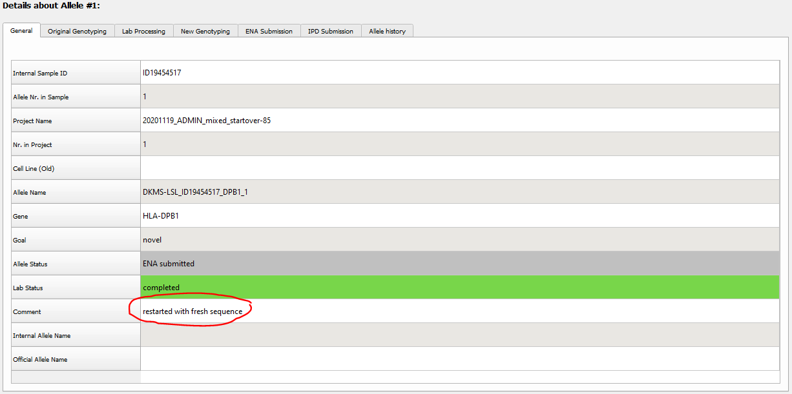
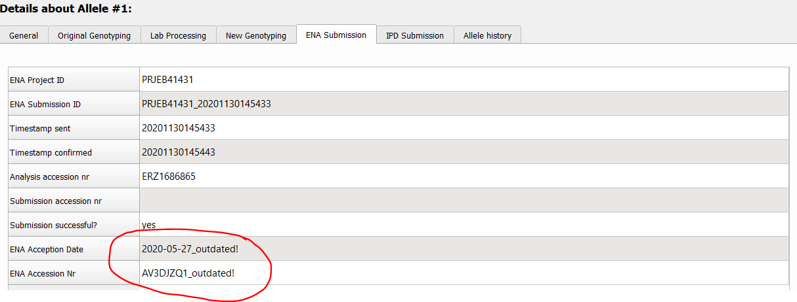
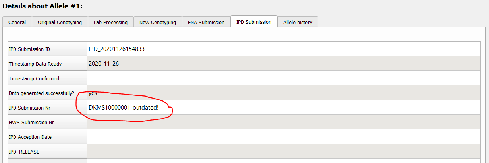
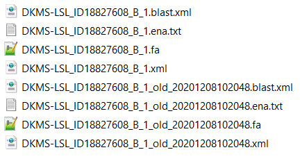

#  Restarting an allele 
TypeLoader assumes that [=> the sequences you upload to it](new_allele.md) are correct. 

However, it is always possible that it later turns out that a sequence was not correct, be it due to sequencing errors or a mistake in the workflow. Starting with version 2.9.0, TypeLoader provides the necessary functionality to ensure this can be treated in a consistent way.

**Any sequence corrections must be performed on the input file!**
 
Then you can upload this corrected file to TypeLoader to generate clean submission files.

## Unsubmitted alleles 

If the allele in question has not been submitted to ENA or IPD yet, please simply delete the allele from TypeLoader by RightClicking on it in the Navigation Area and selecting `Delete Allele`. Then, upload an input-file with the corrected sequence to generate the allele again, this time correctly.

## Alleles already submitted 

**ENA does currently not allow updating of sequences that already have an assigned ENA ID.** Therefore, your next steps depend on how far along your submission already is.

### If allele has been submitted to ENA but not to IPD

Use the ENA web portal to withdraw your the submission of this sequence.

Then continue as described under "Unsubmitted allele".

### If allele has been submitted to ENA and IPD

If the allele in question has already been submitted to IPD, they will require you to resubmit corrected files. 

Please make all necessary corrections to your input file and save the corrected fasta or XML file.

Then RightClick your allele in the Navigation Area and select `Restart Allele`. 

You will then get a warning notifying you of the consequences. After confirming your awareness of this, you will be led to the [=> New Allele dialog](new_allele.md), where you can upload your corrected input file. This way, TypeLoader can create a fresh ENA file for your allele, which will contain the corrected sequence and be correctly annotated.

If the reference database has been updated since you originally created your allele, TypeLoader will ask you whether you want to [=> temporarily reset your database](database_reset.md) to the version originally used, to ensure that the same reference allele is found (if the changed sequence still has this as closest known allele). This is usually a good idea, but you may want to ask IPD whether they prefer to have the corrected files based on the originally used or current database version. **Note that if you decline this and your allele was already contained in an IPD release, TypeLoader may now find the originally submitted sequence as closest known allele - or another allele that was not known during original submission - , marking your allele as confirmation now although it was novel at the time!**

The restarted allele will now look like any new target allele, with the following differences:

- The comment field of your allele will be updated to contain the phrase "restarted with fresh sequence" (along with any content it had prior to restarting):
 

- If you had already created IPD files (and therefore, TypeLoader knows the accession number you got from ENA), the accession number will be kept but marked as outdated along with the ENA acception date: 

- If you had already created IPD files, the IPD submission Number will be kept but marked as outdated:

- All previous files of your allele *will be kept*, but marked with the appendix '_old_{timestamp}', containing the timestamp of the restart. This way, you always have the possibility to track the changes you made and later change your mind to restart with the original sequence etc. :

**As always, TypeLoader assumes you are uploading correct sequences. It is YOUR responsibility to make sure that the sequence you enter is now really correct.** TypeLoader will check that the allele you upload during Restart has the same locus as the original allele (because otherwise, the allele name will become misleading), but otherwise it will accept any sequence as long as your input file meets the [=> usual minimal requirements](new_allele_requirements.md). **TypeLoader will NOT check or compare the new sequence to the old one in any way!**

To compare the new files with the original files, use the "Compare files" functionality of the [=> View Files Dialog](view_files.md). 

## Resubmitting the updated files

### ENA

**ENA does not currently allow updating existing sequences.**

Therefore, you have to use the normal [=> ENA submission](submission_ena.md) workflow to submit your updated sequence, and you will get a new sequence ID from ENA. 

### IPD

Please notify IPD that you need to correct a sequence, and which allele is concerned. If the reference database has been updated between your original submission and now (TypeLoader will check this during the "Restart Allele" process and let you know if it is the case), ask IPD whether they prefer the corrected files to be built against the original reference or the current one.

Using the reference database version they ask for, the new ENA acception reply and the original pretyping file, generate fresh IPD files using the normal [=> IPD submission](submission_ipd.md) functionality. Then send the corrected files to IPD via your usual channel and ask them to update the allele for you. **Let them know explicitly that the ENA id associated with your sequence has changed!** 

**Once you have created fresh, corrected IPD files, the '_outdated!' markers on the respective fields of ENA- and IPD-submission will vanish again.** 
So you can always tell whether the correction has been finished by this marker.

Once IPD has corrected their sequence, you can withdraw the old, incorrect allele from ENA using their web interface, as IPD will no longer reference it.
