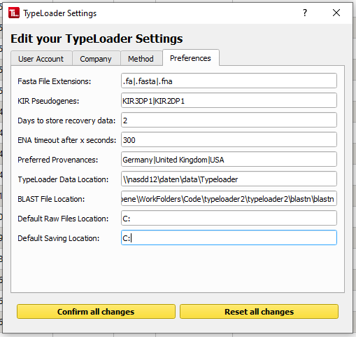

#  Settings

TypeLoader has a settings dialog to view and edit your user settings. You can access it either by clicking the  symbol in the task bar (upper right) or choosing "Options" => "Edit user settings" in the menu.

This will open the settings dialog:

## User Account Settings

In the first tab, you can see and edit all settings about your user account, including your password. Please note that your login name can **not** be changed, as it is used to store the files created by this user. 

## Company & Communications Settings

In the second tab, you can see and edit data about your company, mainly the contact data used for communication with ENA and IPD. By default, this dialog holds the values you entered during TypeLoader's Setup, but you can change them here. (While the default values from setup are used for every user account, you can only edit them for each individual user.)

## Lab Method Settings

In the third tab, you can enter data about the methods applied by your lab to characterize the alleles you upload to TypeLoader. These are included in all IPD submission files, so they **must** accurately represent the methods applied in your lab. Note that several of these are required for acceptance by IPD (see [IPD's submission page](https://www.ebi.ac.uk/ipd/imgt/hla/subs/submit.html) for details).

 **Currently, TypeLoader assumes that all your samples come from the same workflow, so these metadata are stored here globally. (You can, however, overwrite some of these for individual samples, see [=> Changing method metadata](changing_metadata.md).)**

**If you are generating TypeLoader alleles from different workflows within your lab (other than merely using different sequencing technologies), you can either create one [=> TypeLoader-user](users.md) per workflow and configure each accordingly (recommended), or you could update the metadata in your settings accurately every time before you create IPD files (error prone!).**

## Preferences

In the last tab, you can set your personal preferences as well as parameters for TypeLoader:

 * **Fasta file extensions**: these file extensions are recognized as fasta files. The list must be delimited by | (no spaces).
 * **KIR pseudogenes**: these KIR genes are recognized and treated as pseudogenes. The list must be delimited by | (no spaces).
 * **Days to store recovery**: when you close TypeLoader, all *your* recovery data (log files and database dumps) *older than this many days* are deleted.
 * **TypeLoader data location**: This is the path where TypeLoader stores the data it generates. This path is set during installation and can **not** be changed afterwards.
 * **Default raw files location**: Here you can enter where you usually store the raw files for TypeLoader. (When you upload files to TypeLoader, it will initially search for them here.)
 * **Default saving location**: Here you can enter where you usually want to save the files generated by TypeLoader (which will mainly be the files for IPD submission). When you download files from TypeLoader, it will initially offer to save them here.
 * **BLAST File location**: This is where blastn is stored on your computer (on Windows, TypeLoader does this during setup). If you change this path, make sure that blastn is in the new path!

## Editing settings

Whenever you edit a setting, the Confirm and Reset button on the bottom of the dialog will become yellow until you click either of them to confirm or reset your changes. You will not be able to close the settings dialog while you have unsaved changes.
