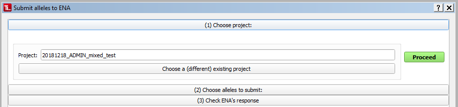
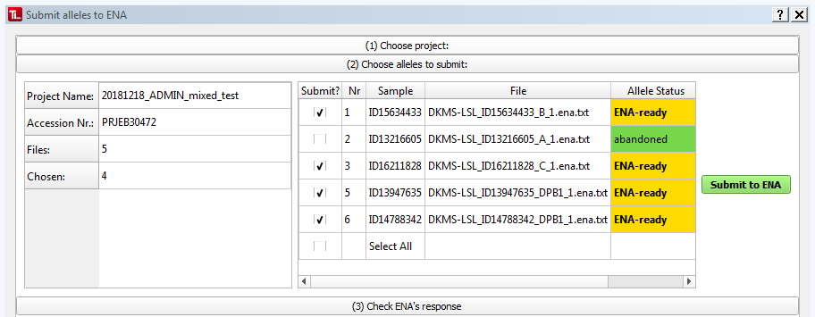
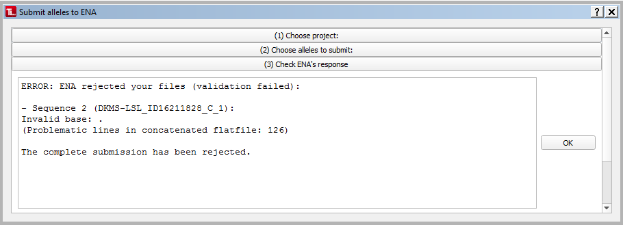
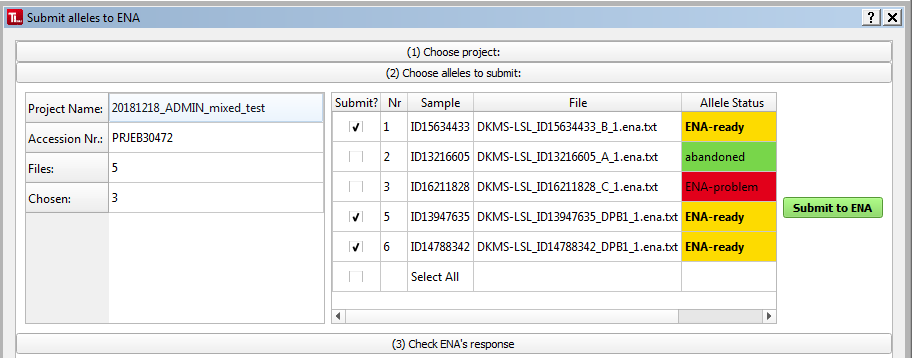

#  Submit alleles to ENA 
To submit (one or multiple) alleles to ENA, click ``Submit to ENA`` in the menu or toolbar, or choose ``Submit project to ENA`` in the [=> Project Overview](overview_project.md).

This will open the ENA Submission Dialog:

##  (1) Choose a project 
Your currently selected project will be pre-selected. To choose a different project (or select one in the first place if there is no currently selected project, yet), click ``Choose a (different) existing project`` and you will get a list of all currently open projects to choose from.

Clicking ``Proceed`` will take you to the next step.

##  (2) Choose alleles to submit 

On the left, you can find information about the project you have selected and how many of how many overall alleles you have currently selected for submission.

Of the right, you find a list of all alleles of the project with their respective allel status values [=> color-coded](colors_icons.md).

All alleles that have the allele status ``ENA-ready`` are automatically pre-selected.

You can select or deselect any allele by clicking the checkbox in the ``Submit?`` column. (You can also re-submit alleles that have already been submitted.)

Clicking the ``Select All`` box will select or deselect all alleles.

After you have selected the alleles you want to submit (must be at least one allele), click ``Submit to ENA`` to continue.

##  (3) Check ENA's automatic response 
This section shows you the automatic response generated by ENA.

###  Submission successful 

If all alleles passed ENA's tests, this will say ``Submission has been committed.`` 

(If you do this on a [=> Test Account](users_test.md) (as you *really* should if you're doing this the first time!), the message will also contain the part ``This submission is a TEST submission and will be discarded within 24 hours``. This tells you this submission was accepted by the test server, so your files are ok and can now be uploaded to your productive account and submitted to the productive server.)

Click ``OK`` to save the results to TypeLoader. All alleles will then have their allele status values updated to ``ENA submitted``.

###  Submission not successful 

If even one allele of the submission fails ENA's tests, ENA will refuse the whole submission.

As a reply, you get a list of what problem was found for each problematic sample. (For your convenience, TypeLoader will automatically insert the appropriate allele name into these messages.)

 **Best save these messages to a text document so you can work on correcting the problems later.**

Click ``OK`` to save the results to TypeLoader. All problematic alleles will have their allele status values updated to ``ENA-problem``, while the non-problematic samples retain their status ``ENA-ready``:

To submit all alleles that are ok, re-open the ENA Submission Dialog. Now, the problematic alleles will not be auto-selected because of their new status: 

If you now click ``Submit to ENA`` again, ENA will accept these alleles and their status values will change accordingly:

Then you can go edit the ENA-files of the problematic alleles and try resubmitting them. (If you forgot to save ENA's reply about what the problem was, you can always re-submit them to re-generate the messages. As long as the problem has not been fixed, ENA will keep rejecting them.)
