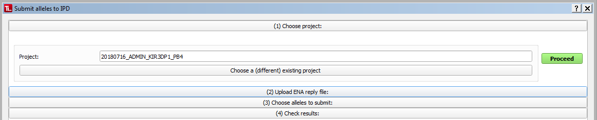
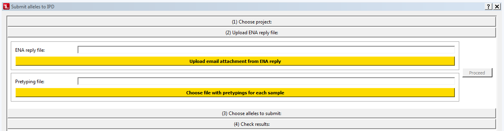
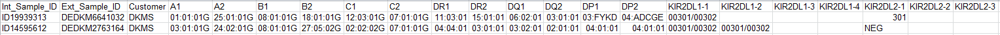
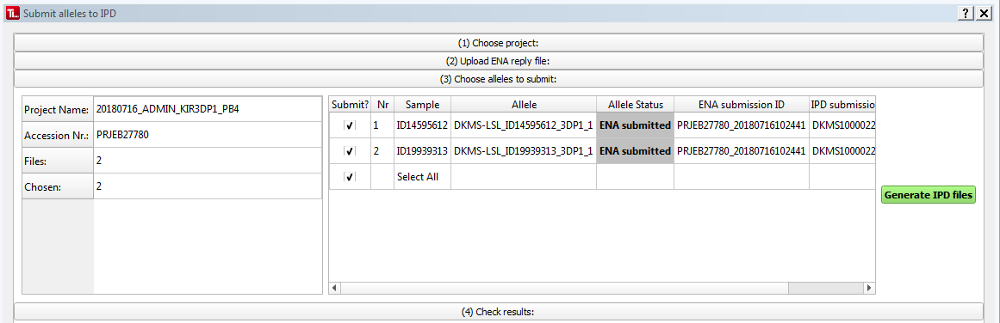
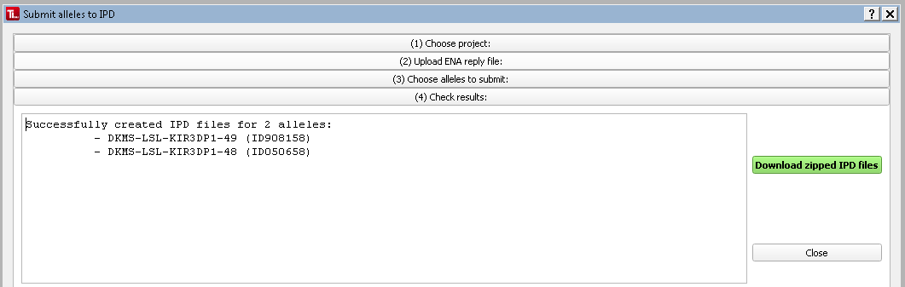

#  Submit alleles to IPD 
 **Your IPD user settings will be incorporated into the IPD files you generate. So make sure yours are ok before you start (using the [=> Settings Dialog](settings.md)). If this is your first IPD submission, create just one file and manually copy the data into [IPD's Submission Page](https://www.ebi.ac.uk/ipd/imgt/hla/subs/submit.html) to receive your submittor ID for future submissions. ([=> How to feed TypeLoader's results into IPD's webform](ipd_webform.md)). Then follow the instructions for [=> Registering as a bulk submittor with IPD](ipd.md).**

To submit (one or multiple) alleles to IPD (IMGT/HLA or KIR), click ``Submit to IPD`` in the menu or toolbar, or choose ``Submit project to IPD`` in the [=> Project Overview](overview_project.md).
This will open the IPD Submission Dialog:

 **Submission to IPD can only be performed for alleles which have been submitted to ENA and have received an ENA submission number!**

 **The first time you use this dialog, TypeLoader will remind you to make sure your [=> Settings](settings.md) accurately reflect your workflow and your IPD contact data are correct, as these will be incorporated into the generated IPD files.**

##  (1) Choose a project 
Your currently selected project will be pre-selected. To choose a different project (or select one in the first place if there is no currently selected project, yet), click ``Choose a (different) existing project`` and you will get a list of all currently open projects to choose from.

Clicking ``Proceed`` will take you to the next step.

##  (2) Upload additional files 

Here, you will have to upload the additional files needed for IPD:

###  ENA reply file 
You will find this file attached to the email you received from ENA once your ENA submission was accepted. (It has no file extension.)

TypeLoader needs it to find the ENA accession number of each allele, which is required for IPD submission.

Save this file to anywhere on your computer and click ``upload email attachment from ENA reply`` to choose and upload it to TypeLoader.

###  Pretyping file 
For each target allele, IPD requires the genotyping results for all other loci known for this sample, which must be at least HLA-A, HLA-B and HLA-DQB1 plus the locus you are submitting. These can be provided to TypeLoader in a .csv file with the following columns and one line per target allele to be submitted:

  * **Internal donor ID**: **this column is used identify the sample!** 
  * **Cell line**: optional, can also be left blank (but **NOT** deleted!)
  * **Customer**: the customer who sent this sample; this information is saved in TypeLoader
This is followed by several columns per locus:
  * **HLA loci:** 2 columns per locus (one per allele), "A1", "A2" etc. (genotyping results should be at maximal resolution and contain no locus)
  * **KIR loci:** 4 columns per locus (one per possible allele), "KIR2DL1-1", "KIR2DL1-2" etc. (genotyping results should be shortened to 3 field resolution or be given as POS/NEG for absence/presence. Cells that are not needed should be left blank).

Example file:

 **You can download an example file with the right format and headers from TypeLoader's menu: ``Options`` => ``Download example files`` => ``Pretypings File``. You can use this as a template to fill in your data, either manually or from your LIMS etc.**

Click ``Choose file with pretypings for each sample`` to choose and upload this file to TypeLoader.

##  (3) Choose alleles to submit 

On the left, you can find information about the project you have selected and how many of how many overall alleles you have currently selected for submission.

Of the right, you find a list of all alleles of the project **that were contained in the ENA file you uploaded** with their respective allel status values [=> color-coded](colors_icons.md).

All alleles that have the allele status ``ENA submitted`` or ``ENA accepted`` are automatically pre-selected.

You can select or deselect any allele by clicking the checkbox in the ``Submit?`` column.

Clicking the ``Select All`` box will select or deselect all alleles.

After you have selected the alleles you want to submit (must be at least one allele), click ``Generate IPD file`` to continue.

##  (4) Check results 

This section will tell you whether TypeLoader was successful in creating the IPD files or encountered any problems.

From here, you can download a zipped version of all IPD files generated in this submission session, by clicking the green ``Download zipped IPD files`` button. These files can now be submitted to IPD per email.

 **If you don't download this now, you can still get the individual files for each target allele by going to each allele's [=> SampleView](view_sample.md) and clicking ``Save files``. But you will have to do that for each allele individually, which might be laborious (depending on the number of alleles submitted). So downloading it now is probably a very good idea. ;-).**

Now you can close the dialog by clicking ``Close`` or the X button.

TypeLoader will now update the allele status of each target allele to ``IPD submitted`` (as it assumes you will send the files to IPD within the day or so).

Now you just have to submit the downloaded files to IPD by the method they have given you (either email or upload to a shared folder).