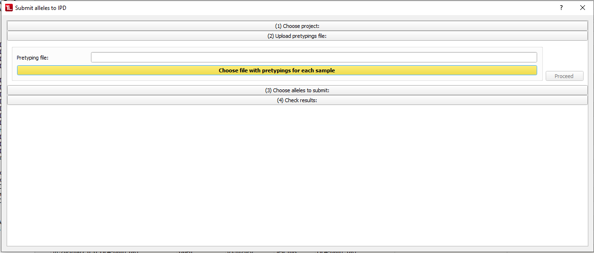

#  Submit alleles to IPD 

Once ENA has notified you by email that they have assigned accession numbers to a project, you can proceed to IPD submission.

 **Your IPD user settings will be incorporated into the IPD files you generate. So make sure yours are ok before you start (using the [=> Settings Dialog](settings.md)). If this is your first IPD submission, create just one file and manually copy the data into [IPD's Submission Page](https://www.ebi.ac.uk/ipd/imgt/hla/subs/submit.html) to receive your submittor ID for future submissions. ([=> How to feed TypeLoader's results into IPD's webform](ipd_webform.md)). Then follow the instructions for [=> Registering as a bulk submittor with IPD](ipd.md).**

To submit (one or multiple) alleles to IPD (IMGT/HLA or KIR), click ``Submit to IPD`` in the menu or toolbar, or choose ``Submit project to IPD`` in the [=> Project Overview](overview_project.md).
This will open the IPD Submission Dialog:

 **Submission to IPD can only be performed for alleles which have been submitted to ENA and have received an ENA submission number!**

 **The first time you use this dialog, TypeLoader will remind you to make sure your [=> Settings](settings.md) accurately reflect your workflow and your IPD contact data are correct, as these will be incorporated into the generated IPD files.**

##  (1) Choose a project 
Your currently selected project will be pre-selected. To choose a different project (or select one in the first place if there is no currently selected project, yet), click ``Choose a (different) existing project`` and you will get a list of all currently open projects to choose from.

Clicking ``Proceed`` will take you to the next step.

##  (2) Upload pretypings file 

Here, you will have to upload additional data needed for IPD:

**Note:** before TypeLoader version 2.14, you had to upload an ENA reply file at 
this point. 
These files are no longer sent by ENA. Instead, TypeLoader now receives the ENA 
accession numbers directly from ENA's server at this point. 

###  Pretyping file 
For each target allele, IPD requires the genotyping results for all other loci known for this sample. See [=> Pretypings file](pretypings.csv) for detailed documentation of how to create this file.

Once you have your pretypings file, click ``Choose file with pretypings for each sample`` to choose and upload this file to TypeLoader.

Then click the green ``Proceed`` button.

##  (3) Choose alleles to submit 

On the left, you can find information about the project you have selected and how many of how many overall alleles you have currently selected for submission.

Of the right, you find a list of all alleles of the project **that have ENA accession numbers and pretypings** with their respective allel status values [=> color-coded](colors_icons.md).

All alleles that have the allele status ``ENA submitted`` or ``ENA accepted`` are automatically pre-selected.

You can select or deselect any allele by clicking the checkbox in the ``Submit?`` column.

Clicking the ``Select All`` box will select or deselect all alleles.

After you have selected the alleles you want to submit (must be at least one allele), click ``Generate IPD file`` to continue.

##  (4) Check results 

This section will tell you whether TypeLoader was successful in creating the IPD files or encountered any problems.

From here, you can download a zipped version of all IPD files generated in this submission session, by clicking the green ``Download zipped IPD files`` button. These files can now be submitted to IPD per email (or whichever way IPD told you to submit your files).

 **If you don't download this now, you can still get the individual files for each target allele by going to each allele's [=> SampleView](view_sample.md) and clicking ``Save files``. But you will have to do that for each allele individually, which might be laborious (depending on the number of alleles submitted). So downloading it now is probably a very good idea. ;-).**

Now you can close the dialog by clicking ``Close`` or the X button.

TypeLoader will now update the allele status of each target allele to ``IPD submitted`` (as it assumes you will send the files to IPD within the day or so).

Now you just have to submit the downloaded files to IPD by the method they have given you (either email or upload to a shared folder).

## Troubleshooting:

The following errors can occur:

 - [=> Database version changed between ENA and IPD submission](err_db_changed.md)
