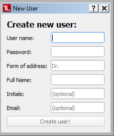

#  User Accounts 

TypeLoader offers user accounts so that multiple users of the same lab can use it simultaneously. To use Typeloader, you will need to create at least one user account.

For each user account that is created, TypeLoader will create a folder within its main data folder, where all of this user's data is stored. This includes:

 * all project and allele files
 * a database containing all metadata of this user's projects and alleles
 * a configuration file containing this user's settings 

**Each account can only access its own projects and alleles!**

So if you are sure there will only be one TypeLoader user at a time in your lab (e.g., because it will only be installed on one computer), it might be most convenient to have just one productive user account for your lab and share the login.

## Creating a User Account ##

To create a user account, click the ``Create new user`` button on the login screen. This will open the ``New user dialog``:

Here, you can create a user account. 

### Optional settings:
 * **Initials:** if not given, these are created from the full name. These are used in project names. 
 * **Email:** you can also specify this later. It is needed for the IPD files, where you will be listed as submittor.

After successfully creating a user account, TypeLoader will create everything needed for this account and log into it.

### Test User Accounts
 **We highly recommend you create a test user account first**, to validate your server connections and try things out.

See [=> here](users_test.md) for details. 