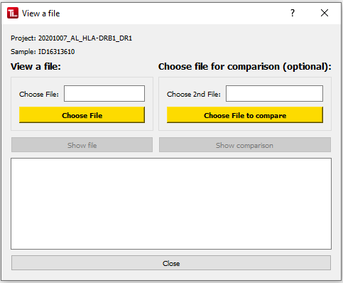
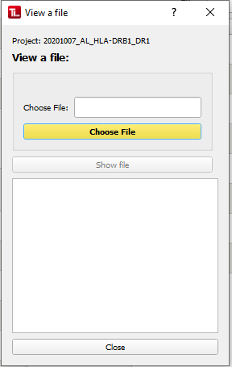
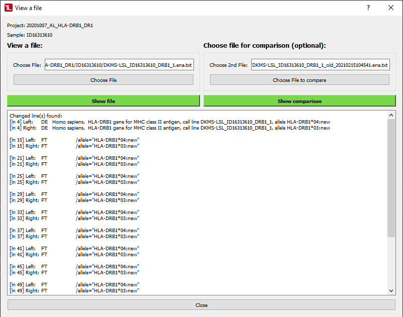

#  View Files
This dialog allows the user to view TypeLoader-generated files without having to download them.
It also allows comparing 2 files of the same type with each other.

The "View Files" dialog can be accessed from the [=> Sample View](view_sample.md) or [=> Project View](view_project.md): 

 

(Left: viewing a Sample's files, right: viewing a Project's files)

## Viewing a file
To view a TypeLoader-generated files, click the "Choose File" button on the left, select the file you are interested in, then click "Show file" underneath.

**Note that you can only view files that belong to the sample or project you started the dialog from!**

## Comparing two files (only for Sample files)
To compare a TypeLoader-generated file with a different version of it, first choose a file. (Same rules as "Viewing a file".) Then, use the right button to choose a second file for comparison, then click "Show comparison".

Both files must have the same file ending (otherwise comparisons make no sense, anyway). 

### Possible results:

#### Both files are identical:
If both files contain the same content, "Files are identical!" is displayed.

#### Files are different:
If there are differences between both files, all not-identical lines are displayed:

All changes include the line number, the line in the left file, and the line in the right file.

