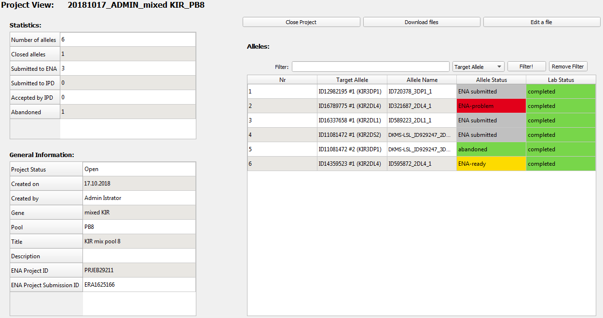

#  Project View 
This [=> Detailed View](detailed_views.md) shows the current state and all data concerning one TypeLoader project.

To open it, choose a project (either in the [=> Navigation Area](navigation.md), the [=> Project Overview](overview_project.md) or [=> Allele Overview](overview_alleles.md), rightclick on it and select ``Open Project View``, or just doubleclick the project in the [=> Navigation Area](navigation.md):

The data in this view is organized in three tables:

  * **Statistics**: (upper left) how many samples are contained, and how many have reached which status
  * **General Information**:: (lower left) details and IDs describing this project
  * **Alleles:** (right) a list of all alleles of this project

##  Statistics 
This table gives a summary of all statistical data of this project:

  * How many alleles are contained? (nr\_alleles)
  * How many are finished? (closed) (see [=> Colors, icons and status](colors_icons.md) for which status values are considered closed)
  * How many have been submitted to ENA and IPD?
  * How many have been accepted by IPD?
  * How many have been abandoned?

These values are automatically generated and cannot be edited.

##  General Information 
This table shows general information about this project:

  * What is this project's status? 
  * When was it created?
  * What are the details it was created with?
  * What is its ENA project ID and ENA project submission ID?

This table is not editable, to keep the displayed data concordant with what has been submitted to ENA during project creation.

##  Alleles 
This table lists all alleles of a project with their respective allele status and lab status values, which are [=> color-coded](colors_icons.md).

The list is sorted by the order in which the alleles were uploaded (listed in the column ``Nr``).

By rightclicking any of these alleles, you get the option to open its [=> Sample View](view_sample.md), where you can see more details about it and make necessary edits.

##  Changing a project's status  
A project can be ``Open`` or ``Closed``. (For details, see [=> Colors, icons and status](colors_icons.md).)

To switch a project's status, click the ``Close Project`` or ``Open Project`` button (whichever applies; the button will change its text accordingly) in the center top area. 

## Accessing a project's files
In the top right area, there are two buttons that allow interaction with a project's files:

 * ``Download files`` opens a dialog where you can choose any of this project's files and save them to a place of your choice.
 * ``Edit a file`` opens a dialog where you can choose any of this project's files. This file will be opened in a window where you can read it. This window also allows editing. 
 
  **Do not edit project files without *VERY* good reason!** These files usually contain data about the project's submission to ENA. Therefore changes to them can lead to incongruence with ENA's data! 
