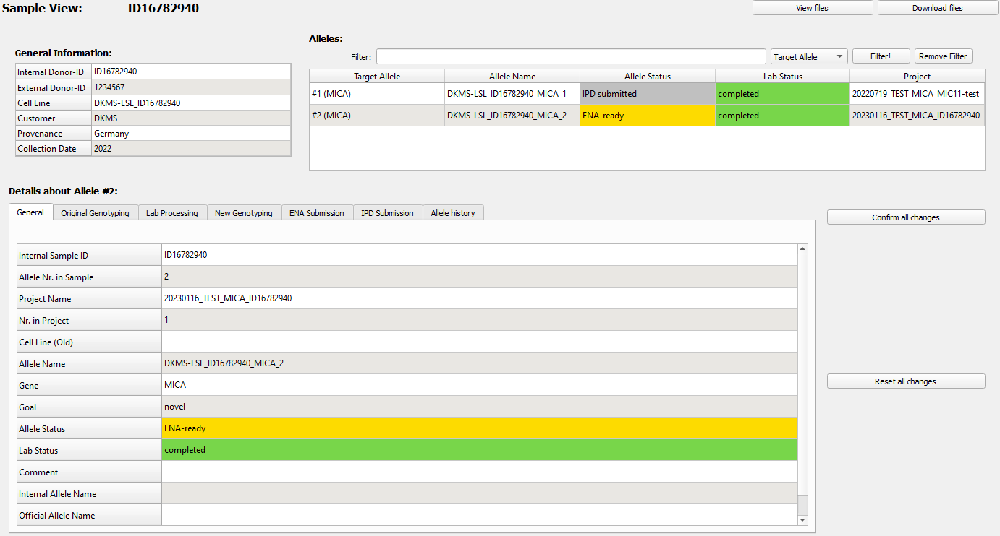

#  Sample View 
This [=> Detailed View](detailed_views.md) shows the current state and all data concerning one TypeLoader sample in one project.

To open it, choose a target allele (either in the [=> Navigation Area](navigation.md), the [=> Allele Overview](overview_alleles.md), or the allele's [=> Project View](view_project.md)), rightclick on it and select ``Open Sample View``, or just doubleclick the allele in the [=> Navigation Area](navigation.md):

The data in this view is organized in three tables:

  * **General Information**: (upper left) data about the sample from which the target allele was derived
  * **Alleles**: (upper right) all target alleles generated from this sample
  * **Allele Details:** (bottom) detailed information about the chosen target allele (to choose a different allele, click on it either in the [=> Navigation Area](navigation.md) or the alleles table (upper right)). This data is arranged in tabs grouped by a common topic.

Additionally, there are two buttons to interact with the sample's files:

  * **View files** opens a dialog in which the text files of this sample can be selected and viewed. (see below for details)
  * **Download files** opens a dialog with which a file of this sample can be selected and downloaded to a location of choice.

(See below for more details.)

Many of the values in this view can be edited, although some are protected from editing to ensure data consistency. All edits have to be confirmed via the ``Confirm all changes`` button (or rejected via the ``Reset all changes`` button) before any other view can be used.

##  General Information 
This table gives information about the sample from which the target allele was sequenced:

  * Internal sample ID
  * External sample ID
  * Cell line
  * Customer
  * Provenance
  * Collection Date

The table can be edited to add or change the customer, provenance and collection date. 
It is also possible to change the external sample ID (to correct mis-spellings etc.) 
via a rightclick menu.

##  Alleles 
This table shows all target alleles generated from this sample, with information to identify them and easily see their status values:

  * Which allele is this within this sample?
  * What is its allele ID?
  * What are its allele status and lab status (both are [=> color-coded](colors_icons.md))?
  * To which project does it belong?

 **Note that this list is not limited to the current project. If any alleles of the same sample are contained in a different project of the same user, they are displayed here, too.**

**For more details about multiple target alleles for one sample, see [=> Multiple alleles of one sample](multiple_alleles.md).**

This table is not editable. It can be filtered on all columns using the filter above it.

Clicking any row will re-filter the Allele Details section below to this allele.

##  Allele Details 
This section displays lots of detailed information about the chosen target allele. For ease of use and comprehension, the information is sorted into categories and displayed in tabs (one tab per category):

  * **General**: general information about the target allele and its status
  * **Original genotyping**: information about the original genotyping during primary analysis (note: not used, yet!)
  * **Lab processing**: information about the lab processing steps and lab progress on the sample (note: not used, yet!)
  * **New genotyping**: information about the full length secondary genotyping 
  * **ENA submission**: information about the ENA submission of the target allele (note: only filled after successful ENA submission)
  * **IPD submission**: information about the IPD submission of the target allele (note: only filled after successfully generating an IPD submission file)

The data in all tabs is editable, although some rows have been protected from editing to keep the data consistent with what has been submitted. 

All allele status and lab status values are [=> color-coded](colors_icons.md).

##  File Buttons 
###  View files 
Clicking this button will open a dialog with which you can choose a file of this sample to view or compare with a different version of it (e.g., after you performed [=> Restart Allele](restart_allele.md)).

For details, see [=> View Files](view_files.md).

**Note that editing the files is not possible, as this might lead to discrepancies between the files and submitted data.** If you need to edit the sequences (e.g., because you found out that there was a mistake in the sequence), please use the [=> Restart Allele](restart_allele.md) option.

###  Download a file 
Clicking this button will open a dialog with which you can choose a file of this sample to download to a location of your choice.

Click ``Choose files`` to choose the file you want to download.

 **While files of other samples are visible in this dialog, TypeLoader will not allow you to download them from here. To access them, please go to the SampleView showing this sample and the click ``Choose File``.**

**If your project contains several alleles of the same sample, you can access both from the same sample-view, though.**

After you have successfully chosen a file, you can click the now green ``Download!`` button. Then you will be asked to specify the path where to save the file. After confirming, the file you have chosen will be saved there.

 **Note that if you download and then edit a file, TypeLoader will not know your changes. So if you intend to make changes, you should use the [=>Restart Allele](restart_allele.md) option to generate new, consistent files.**
